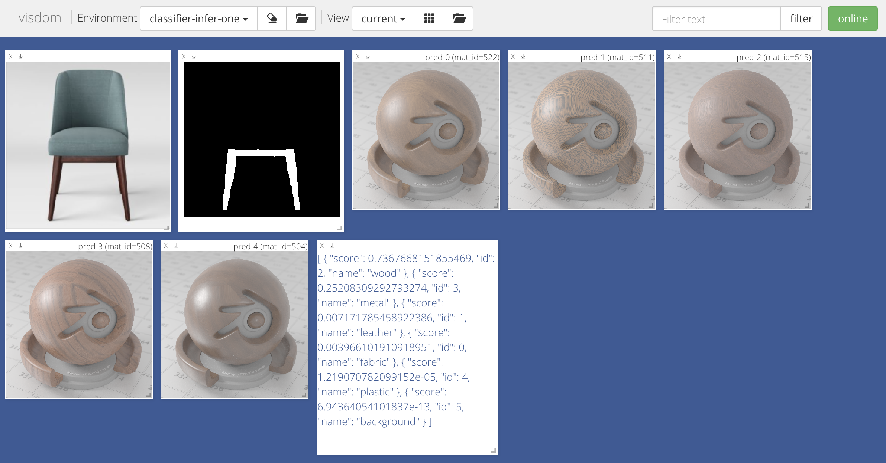

# PhotoShape

Create by [Keunhong Park](https://keunhong.com), [Konstantinos Rematas](https://homes.cs.washington.edu/~krematas/), [Ali Farhadi](https://homes.cs.washington.edu/~ali/), and [Steven M. Seitz](https://homes.cs.washington.edu/~seitz/).

[[Project Page](https://keunhong.com/publications/photoshape/)] [[arXiv](https://arxiv.org/abs/1809.09761)]

## Citing PhotoShape

If you find PhotoShape useful, please consider citing:

```bibtex
@article{photoshape2018,
 author = {Park, Keunhong and Rematas, Konstantinos and Seitz, Steven M. and Farhadi, Ali},
 title = {PhotoShape: Photorealistic Materials for Large-Scale Shape Collections},
 journal = {ACM Trans. Graph.},
 issue_date = {November 2018},
 volume = {37},
 number = {6},
 month = nov,
 year = {2018},
 articleno = {192},
} 
```


## Getting Started

We try to provide everything required to get up and running, but due to licensing and copyright restrictions 
you will have to download/purchase some data directly from the source.

### Python Environment

I recommend pyenv for managing python environments, but anything should work.

```bash
# Install pyenv
curl -L https://github.com/pyenv/pyenv-installer/raw/master/bin/pyenv-installer | bash
pyenv update

# Install dependencies and python
sudo apt-get install -y make build-essential libssl-dev zlib1g-dev libbz2-dev \
libreadline-dev libsqlite3-dev wget curl llvm libncurses5-dev libncursesw5-dev \
xz-utils tk-dev libffi-dev liblzma-dev
pyenv install 3.7.0
pyenv virtualenv 3.7.0 photoshape

# Enter the environment and set paths
source env.sh
```

### Install Dependencies

If you just need to use the network, all you'll need is the basic dependencies.

```bash
pip install torch torchvision
pip install -r requirements.txt
```

If you want to run code that requires the dense CRF implementation, you'll need to install that package. This includes the
fine alignment step and the substance segmentation for exemplars.

```bash
# For dense CRF (needed for substance segmentation).
pip install git+https://github.com/lucasb-eyer/pydensecrf.git
```

Unfortunately our code for rendering segments and alignment renderings involves some custom shaders with vispy. This can be 
finnicky to set up. You'll need to install the following fork of PyOpenGL which supports NVIDIA extensions.

```bash
# For custom shader support (needed for rendering certain stuff in pipeline)
pip install git+https://github.com/mcfletch/pyopengl.git
```

Please create an issue if something doesn't work as expected and I'll try to address it.

### Installation

First we have to fetch this codebase.

```bash
# Clone this repository
git clone git@github.com:keunhong/photoshape.git
git submodule update --init --recursive

# Extract metadata
cd resources && tar xvzf metadata.tar.gz && cd ..
```


### Database Setup

To facilitate efficient querying and data storage we use PostgreSQL for most metadata.

First install [docker](https://docs.docker.com/install/linux/docker-ce/ubuntu/) and [docker-compose](https://docs.docker.com/install/linux/docker-ce/ubuntu/) following the instructions linked.
Once you have those installed, run the database using the following command:

```bash
# Remove -d to show logs
docker-compose up -d

# You can stop the service by running 
# docker-compose down
```

Once the database is initialized and running, you can import data from the provided SQL dumps:

```bash
docker exec -i $(docker-compose ps -q postgres) psql -U photoshape_user photoshape_db < data/postgres/envmaps.sql
docker exec -i $(docker-compose ps -q postgres) psql -U photoshape_user photoshape_db < data/postgres/exemplars.sql
docker exec -i $(docker-compose ps -q postgres) psql -U photoshape_user photoshape_db < data/postgres/shapes.sql
docker exec -i $(docker-compose ps -q postgres) psql -U photoshape_user photoshape_db < data/postgres/materials.sql
docker exec -i $(docker-compose ps -q postgres) psql -U photoshape_user photoshape_db < data/postgres/exemplar_shape_pair.sql
```

### Configuration

Data directories and paths are defined in `src/terial/config.py`. Modify the directories so that they are pointing to the
correct location on your disk(s). We've created a basic skeleton of the directory structure in `data`. 


## Data Sets

Blob data associated with rows in the database are stores in a blobs directory. This directory can be configured in 
`config.py` by modifying `BLOB_ROOT`. We recommend using a large disk for this since the data generated can be quite 
large.

### Exemplar Images

We've preprocessed exemplar images. Download them to `data/blobs`

```bash
cd data/blobs
curl -L -O https://homes.cs.washington.edu/~kpar/photoshape/blobs/exemplars.tar.gz
tar xvzf exemplars.tar.gz
```

### Shapes
#### Herman Miller

You will have to download and process Herman Miller 3D shapes. Please review their 
[terms of use](https://www.hermanmiller.com/legal/terms-of-use/) before proceeding.

```bash
cd data/hermanmiller

# This will download zip files to the zip directory and then 
# extract *.3ds models to the extracted directory.
bash download.sh
```

Next we will import the downloaded shapes and link them to rows in our database. Make sure that all of the *.3ds files are
 in the root of the directory. Some may be in random directories. 

```bash
python -m terial.shapes.link_3ds data/hermanmiller/extracted/
```

The associated shape paths in `data/blobs/shapes` should now have `uvmapped_v2.obj` files.


#### ShapeNet

Download and extract the `ShapeNetCore.v2.zip` file from the [ShapeNet](https://www.shapenet.org) website and extract it to `data/shapenet` 
(or somewhere else, but remember to update the config if you do).

You will need to preprocess the ShapeNet shapes so that they have UV maps. Ensure that 
`SHAPENET_CORE_DIR`, `SHAPENET_TAXONOMY_PATH` and `SHAPENET_META_DIR` are properly set and run

```bash
# Preprocess a certain category.
python -m terial.shapes.preprocess_shapenet --category chair
```

Then we need to import the processed shape files so that the meshes are associated with the database rows.

```bash
python -m terial.shapes.link_shapenet
```


### Materials

You can download the preview renders

```bash
cd data/blobs
curl -L -O https://homes.cs.washington.edu/~kpar/photoshape/blobs/materials.tar.gz
tar cvzf materials.tar.gz
```

#### Adobe Stock
Materials from Adobe Stock are subject to copyright and must be downloaded from their source. Please refer
to the `source_url` field in `materials.json`. 

Place the extracted materials sorted by substance type in the `data/materials/adobe-stock` directory. 

Adobe stock materials should look like this:
```
adobe-stock/fabric/AdobeStock_125038380
├── denim_track_rough
│   ├── denim_track_rough_basecolor.png
│   ├── denim_track_rough_height.png
│   ├── denim_track_rough_metallic.png
│   ├── denim_track_rough_normal.png
│   └── denim_track_rough_roughness.png
└── denim_track_rough.mdl
```


#### Poliigon 
Materials from Poliigon are subject to copyright and must be downloaded from their source. Please refer
to the `source_url` field in `materials.json`. 

Place the extracted materials sorted by substance type in the `data/materials/poliigon` directory. 

Download the 1K version of the materials. Poliigon materials should look like this:

```
poliigon/fabric/FabricCanvas001_1k
├── FabricCanvas001_COL_VAR1_1K.jpg
├── FabricCanvas001_COL_VAR2_1K.jpg
├── FabricCanvas001_DISP_1K.jpg
├── FabricCanvas001_GLOSS_1K.jpg
├── FabricCanvas001_NRM_1K.jpg
├── FabricCanvas001_OBJECTID_1K.png
└── FabricCanvas001_REFL_1K.jpg
```


#### Aittala Beckmann

We provide materials adapted from [Aittala et al.](https://mediatech.aalto.fi/publications/graphics/TwoShotSVBRDF/)
 and scanned ourselves. These SVBRDFs have been adapted from the original Aittala BRDF to the Beckmann model in order to
support rendering using Blender.

Download the files and extract to `data/materials`.

```bash
curl -L -O https://homes.cs.washington.edu/~kpar/photoshape/materials-500x500/aittala-beckmann.tar.gz
tar xvzf aittala-beckmann.tar.gz
```

#### V-Ray Materials

Materials from [vray-material.de](https://www.vray-materials.de).

Download the files and extract to `data/materials`.

```bash
curl -L -O https://homes.cs.washington.edu/~kpar/photoshape/materials-500x500/vray-materials-de.tar.gz
tar xvzf vray-materials-de.tar.gz
```

#### Parametric Materials

Materials with type `BLINN_PHONG` and `PRINCIPLED` are defined in the `params` field of each material in `materials.json`.


## Metadata

We've process our data using PostgreSQL. For your convenience we've exported the data in an easier to use collection of
JSON files found in `data/*.json`.

### `shapes.json`
This file contains meta-data regarding the 3D shapes used in this project.

#### Fields
 * `id`: the unique identifier for the shape
 * `source`: the source of the shape (either shapenet or hermanmiller)
 * `source_id`: the identifier from the source
 * `category`: the object category of the shape (e.g., `chair`, `cabinet`, etc.)
 * `split_set`: our train/validation split used for training our material classifier
 * `azimuth_correction`: a correction to the azimuth of the model orientation used to create preview renderings
 
 
### `exemplars.json`
Contains meta-data regarding the exemplar images.


### `pairs.json`
Contains meta-data for Exemplar-Shape pairs.

#### Fields
 * `id`: a unique identifier for the pair
 * `shape_id`: the id for the shape associated with this pair
 * `exemplar_id`: the id for the exemplar associated wiith this pair
 * `fov`: the field of view of the aligned camera
 * `azimuth`: the azimuthal angle in radians of the aligned camera
 * `elevation`: the elevation angle in radians of the aligned camera
 * `rank`: the rank of this pair in terms of HoG distance between the shape and exemplar.
 
 
### `materials.json`
Contains meta-data for the materials.

#### Fields
 * `id`: the unique identifier for the material
 * `name`: a name for the material
 * `type`: the type of BRDF. One of: POLIIGON, MDL, VRAY, BLINN_PHONG, AITTALA_BECKMANN, PRINCIPLED
 * `author`: the author of the material
 * `source`: the source of the material (e.g., poliigon, adobe_stock, aittala, merl, etc.)
 * `source_id`: the unique identifier from the source
 * `source_url`: the URL the material can be downloaded from
 * `default_scale`: the UV mapping should be scaled by 2^s where s is this value
 
 #### Notes
 * `MDL` is the NVIDIA material definition language.
 * `PRINCIPLED` materials are the Disney principled BRDF as implemented in Blender.
 * `AITTALA_BECKMANN` materials are the [Aittala TwoShot SVBRDF](https://mediatech.aalto.fi/publications/graphics/TwoShotSVBRDF/) materials fitted to the Beckmann model as implemented in Blender.
 * For `BLINN_PHONG` and `PRINCIPLED` materials, the `params` field will contain the material properties.
 * For `MDL` materials, the `params` field will contain material properties and/or locations of textures.
 
 


### `labels.json`
This contains the mapping from `material_id` to output class labels for the material classifier.


## Material Classifier

The weights for our 
Download the our network parameters

```bash
mkdir -p data/classifier
cd data/classifier
curl -L -O https://homes.cs.washington.edu/~kpar/photoshape/classifier/model.tar.gz
tar xvzf model.tar.gz
```

### Example Inference

Let's try to infer the materials on our sample input in `data/classifier/input`. For this example you'll need the 
material blobs downloaded as above and the `config.py` set up properly. You'll also need to have set up the database
since the script will query the database for the materials.

We'll show the inference results using visdom. Please install visdom, and have it running in the background somewhere:

```bash
pip install visdom
python -m visdom.server
``` 

Now you can run the example script:

```bash
python -m terial.classifier.inference.infer_one \
  --checkpoint-path data/classifier/model/model_best.pth.tar \
  data/classifier/inputs/chair1.png \
  data/classifier/inputs/chair1.mask.png
```

You should see the following in visdom if everything works correctly:



